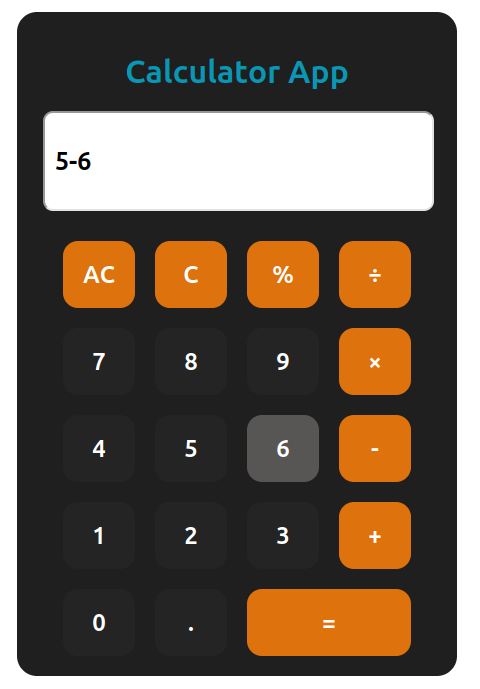

# React Calculator App

This project is a simple calculator application built using React. It demonstrates the use of React hooks, specifically `useState`, to manage the state of the calculator's display and operations.

## Features

- Basic arithmetic operations: addition
- Support for decimal numbers.
- A clear (AC) and backspace (C) functionality.
- A display that shows the current operation and result.

## License

This project is licensed under the MIT License. See the [LICENSE]([LICENSE](https://github.com/srijankarki07/Basic-Unit-Converter/blob/master/LICENSE)) file for details.

Live Demo - https://react-js-calculator-rouge.vercel.app/
